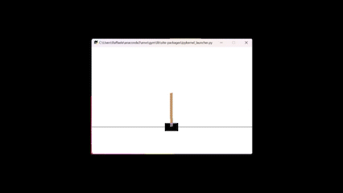

# CartPole-v1 with Q-learning made by  [Raffaele Pumpo](https://github.com/RaffaelePumpo) 

The Cartpole problem is a classic control problem in the field of reinforcement learning. It involves a pole that is attached to a cart, and the objective is to balance the pole upright on the cart by moving the cart left or right. The system is considered solved when the pole is balanced for a certain amount of time, or a certain number of time steps. 

### Tools used

For the following algorithm, I have used "anaconda3", installed gym with:

*pip install gym*

*pip install -U scikit-learn*

*pip install typing*

in the prompt of the anaconda 3.

**Importing required libraries**


```python
from sklearn.preprocessing import KBinsDiscretizer
import numpy as np
import gym
import time , random , math
from typing import Tuple
```

**Build the environment**


```python
env = gym.make('CartPole-v1')
```

## Q-learning

Q-Learning is a model-free, off-policy reinforcement learning algorithm. It is used to learn the optimal policy for a given Markov Decision Process (MDP) by estimating the optimal action-value function (also known as the Q-function). The Q-function represents the expected reward for taking a specific action in a specific state and following the optimal policy thereafter. The Q-learning algorithm updates the Q-function estimates iteratively based on observed state-action transitions and received rewards. The goal of Q-learning is to find the policy that maximizes the expected cumulative reward. Once the Q-function has converged, the algorithm can be used to determine the optimal policy by selecting the action with the highest Q-value for each state.

**Convert the continuous space in discrete one**


```python
n_bins = (6 ,12)
lower_bounds = [env.observation_space.low[2],-math.radians(50)]
upper_bounds = [env.observation_space.high[2],math.radians(50)]

def discretizer(_,__, angle, pole_velocity) -> Tuple[int, ...]:
    est = KBinsDiscretizer(n_bins=n_bins, encode='ordinal', strategy='uniform')
    est.fit([lower_bounds, upper_bounds])
    return tuple(map(int, est.transform([[angle, pole_velocity]])[0]))

```

**Initialise the Q value table with zeros**


```python
Q_table = np.zeros(n_bins + (env.action_space.n,))
```

**Create a policy function using Q-table and  greedly selecting the highest Q value**


```python
def policy ( state : tuple):
    return np.argmax(Q_table[state])
```

**Update the values of the table**


```python
def new_Q_value ( reward : float , state_new : tuple , discount_factor =1) ->float:
    future_optimal_value = np.max(Q_table[state_new])
    learned_value = reward + discount_factor * future_optimal_value
    return learned_value
```

**Define the rates** 


```python
def learning_rate ( n : int , min_rate = 0.1) ->float:
    return max(min_rate, min(1.0, 1.0 - math.log10((n + 1) / 25)))

def exploration_rate ( n : int , min_rate = 0.1) ->float:
    return max(min_rate, min(1, 1.0 - math.log10((n + 1) / 25)))
```

### Training 


```python
n_episodes = 2000
for episode in range (n_episodes):
    current_state , done = discretizer(*env.reset()) , False
    score = 0
    while not done:
        action = policy(current_state)
        if random.random() < exploration_rate(episode):
            action = env.action_space.sample()
        obs, reward, done, info = env.step(action)
        new_state = discretizer(*obs)
        lr = learning_rate(episode)
        learned_value = new_Q_value(reward, new_state)
        old_value = Q_table[current_state + (action,)]
        Q_table[current_state + (action,)] = old_value * (1 - lr) + lr * learned_value
        current_state = new_state
        score += reward
        if episode % 3 == 0:
            env.render()
    print(f'Episode: {episode} Score: {score}')
env.close()
```

    Episode: 0 Score: 15.0
    Episode: 1 Score: 17.0
    Episode: 2 Score: 24.0
    Episode: 3 Score: 13.0
    Episode: 4 Score: 36.0
    Episode: 5 Score: 16.0
    Episode: 6 Score: 11.0
    Episode: 7 Score: 36.0
    Episode: 8 Score: 68.0
    Episode: 9 Score: 25.0
    Episode: 10 Score: 18.0
    Episode: 11 Score: 11.0
    Episode: 12 Score: 45.0
    Episode: 13 Score: 15.0
    Episode: 14 Score: 17.0
    Episode: 15 Score: 15.0
    Episode: 16 Score: 44.0
    Episode: 17 Score: 19.0
    Episode: 18 Score: 22.0
    Episode: 19 Score: 14.0
    Episode: 20 Score: 22.0
    Episode: 21 Score: 15.0
    Episode: 22 Score: 16.0
    Episode: 23 Score: 15.0
    Episode: 24 Score: 17.0
    Episode: 25 Score: 20.0
    Episode: 26 Score: 18.0
    Episode: 27 Score: 24.0
    Episode: 28 Score: 12.0
    Episode: 29 Score: 40.0
    Episode: 30 Score: 28.0
    Episode: 31 Score: 29.0
    Episode: 32 Score: 19.0
    Episode: 33 Score: 14.0
    Episode: 34 Score: 14.0
    Episode: 35 Score: 20.0
    Episode: 36 Score: 28.0
    Episode: 37 Score: 23.0
    Episode: 38 Score: 17.0
    Episode: 39 Score: 15.0
    Episode: 40 Score: 10.0
    Episode: 41 Score: 15.0
    Episode: 42 Score: 22.0
    Episode: 43 Score: 21.0
    Episode: 44 Score: 20.0
    Episode: 45 Score: 17.0
    Episode: 46 Score: 17.0
    Episode: 47 Score: 20.0
    Episode: 48 Score: 16.0
    Episode: 49 Score: 22.0
    Episode: 50 Score: 36.0
    Episode: 51 Score: 15.0
    Episode: 52 Score: 14.0
    Episode: 53 Score: 25.0
    Episode: 54 Score: 13.0
    Episode: 55 Score: 12.0
    Episode: 56 Score: 15.0
    Episode: 57 Score: 14.0
    Episode: 58 Score: 25.0
    Episode: 59 Score: 36.0
    Episode: 60 Score: 19.0
    Episode: 61 Score: 26.0
    Episode: 62 Score: 28.0
    Episode: 63 Score: 11.0
    Episode: 64 Score: 29.0
    Episode: 65 Score: 39.0
    Episode: 66 Score: 42.0
    Episode: 67 Score: 21.0
    Episode: 68 Score: 26.0
    Episode: 69 Score: 13.0
    Episode: 70 Score: 11.0
    Episode: 71 Score: 45.0
    Episode: 72 Score: 17.0
    Episode: 73 Score: 13.0
    Episode: 74 Score: 17.0
    Episode: 75 Score: 10.0
    Episode: 76 Score: 11.0
    Episode: 77 Score: 22.0
    Episode: 78 Score: 12.0
    Episode: 79 Score: 25.0
    Episode: 80 Score: 19.0
    Episode: 81 Score: 20.0
    Episode: 82 Score: 80.0
    Episode: 83 Score: 40.0
    Episode: 84 Score: 50.0
    Episode: 85 Score: 19.0
    Episode: 86 Score: 13.0
    Episode: 87 Score: 56.0
    Episode: 88 Score: 48.0
    Episode: 89 Score: 33.0
    Episode: 90 Score: 70.0
    Episode: 91 Score: 22.0
    Episode: 92 Score: 34.0
    Episode: 93 Score: 57.0
    Episode: 94 Score: 97.0
    Episode: 95 Score: 67.0
    Episode: 96 Score: 103.0
    Episode: 97 Score: 45.0
    Episode: 98 Score: 37.0
    Episode: 99 Score: 63.0
    Episode: 100 Score: 195.0
    Episode: 101 Score: 116.0
    Episode: 102 Score: 35.0
    Episode: 103 Score: 47.0
    Episode: 104 Score: 50.0
    Episode: 105 Score: 200.0
    Episode: 106 Score: 112.0
    Episode: 107 Score: 21.0
    Episode: 108 Score: 132.0
    Episode: 109 Score: 58.0
    Episode: 110 Score: 16.0
    Episode: 111 Score: 34.0
    Episode: 112 Score: 15.0
    Episode: 113 Score: 194.0
    Episode: 114 Score: 69.0
    Episode: 115 Score: 18.0
    Episode: 116 Score: 87.0
    Episode: 117 Score: 55.0
    Episode: 118 Score: 97.0
    Episode: 119 Score: 70.0
    Episode: 120 Score: 500.0
    Episode: 121 Score: 47.0
    Episode: 122 Score: 168.0
    Episode: 123 Score: 29.0
    Episode: 124 Score: 18.0
    Episode: 125 Score: 19.0
    Episode: 126 Score: 52.0
    Episode: 127 Score: 61.0
    Episode: 128 Score: 24.0
    Episode: 129 Score: 79.0
    Episode: 130 Score: 51.0
    Episode: 131 Score: 29.0
    Episode: 132 Score: 26.0
    Episode: 133 Score: 28.0
    Episode: 134 Score: 27.0
    Episode: 135 Score: 75.0
    Episode: 136 Score: 33.0
    Episode: 137 Score: 24.0
    Episode: 138 Score: 21.0
    Episode: 139 Score: 165.0
    Episode: 140 Score: 49.0
    Episode: 141 Score: 13.0
    Episode: 142 Score: 71.0
    Episode: 143 Score: 82.0
    Episode: 144 Score: 95.0
    Episode: 145 Score: 144.0
    Episode: 146 Score: 31.0
    Episode: 147 Score: 164.0
    Episode: 148 Score: 129.0
    Episode: 149 Score: 11.0
    Episode: 150 Score: 71.0
    Episode: 151 Score: 295.0
    Episode: 152 Score: 329.0
    Episode: 153 Score: 47.0
    Episode: 154 Score: 280.0
    Episode: 155 Score: 137.0
    Episode: 156 Score: 344.0
    Episode: 157 Score: 230.0
    Episode: 158 Score: 189.0
    Episode: 159 Score: 27.0
    Episode: 160 Score: 24.0
    Episode: 161 Score: 27.0
    Episode: 162 Score: 187.0
    Episode: 163 Score: 174.0
    Episode: 164 Score: 144.0
    Episode: 165 Score: 263.0
    Episode: 166 Score: 99.0
    Episode: 167 Score: 107.0
    Episode: 168 Score: 107.0
    Episode: 169 Score: 178.0
    Episode: 170 Score: 35.0
    Episode: 171 Score: 68.0
    Episode: 172 Score: 120.0
    Episode: 173 Score: 185.0
    Episode: 174 Score: 25.0
    Episode: 175 Score: 38.0
    Episode: 176 Score: 275.0
    Episode: 177 Score: 174.0
    Episode: 178 Score: 203.0
    Episode: 179 Score: 170.0
    Episode: 180 Score: 36.0
    Episode: 181 Score: 30.0
    Episode: 182 Score: 49.0
    Episode: 183 Score: 36.0
    Episode: 184 Score: 41.0
    Episode: 185 Score: 401.0
    Episode: 186 Score: 105.0
    Episode: 187 Score: 72.0
    Episode: 188 Score: 44.0
    Episode: 189 Score: 49.0
    Episode: 190 Score: 45.0
    Episode: 191 Score: 59.0
    Episode: 192 Score: 364.0
    Episode: 193 Score: 500.0
    Episode: 194 Score: 500.0
    Episode: 195 Score: 500.0
    Episode: 196 Score: 500.0
    Episode: 197 Score: 500.0
    Episode: 198 Score: 500.0
    Episode: 199 Score: 500.0
    Episode: 200 Score: 500.0
    Episode: 201 Score: 500.0
    Episode: 202 Score: 500.0
    Episode: 203 Score: 500.0
    Episode: 204 Score: 500.0
    Episode: 205 Score: 419.0
    Episode: 206 Score: 306.0
    Episode: 207 Score: 500.0
    Episode: 208 Score: 293.0
    Episode: 209 Score: 500.0
    Episode: 210 Score: 500.0
    Episode: 211 Score: 500.0
    Episode: 212 Score: 491.0
    Episode: 213 Score: 500.0
    Episode: 214 Score: 500.0
    Episode: 215 Score: 500.0
    Episode: 216 Score: 500.0
    Episode: 217 Score: 500.0
    Episode: 218 Score: 458.0
    Episode: 219 Score: 500.0
    Episode: 220 Score: 500.0
    Episode: 221 Score: 500.0
    Episode: 222 Score: 500.0
    Episode: 223 Score: 334.0
    Episode: 224 Score: 500.0
    Episode: 225 Score: 500.0
    Episode: 226 Score: 474.0
    Episode: 227 Score: 500.0
    Episode: 228 Score: 500.0
    Episode: 229 Score: 451.0
    Episode: 230 Score: 500.0
    Episode: 231 Score: 301.0
    Episode: 232 Score: 500.0
    Episode: 233 Score: 17.0
    Episode: 234 Score: 500.0
    Episode: 235 Score: 500.0
    Episode: 236 Score: 435.0
    Episode: 237 Score: 500.0
    Episode: 238 Score: 408.0
    Episode: 239 Score: 465.0
    Episode: 240 Score: 500.0
    Episode: 241 Score: 389.0
    Episode: 242 Score: 281.0
    Episode: 243 Score: 500.0
    Episode: 244 Score: 500.0
    Episode: 245 Score: 477.0
    Episode: 246 Score: 340.0
    Episode: 247 Score: 500.0
    Episode: 248 Score: 500.0
    Episode: 249 Score: 466.0
    Episode: 250 Score: 500.0
    Episode: 251 Score: 500.0
    Episode: 252 Score: 500.0
    Episode: 253 Score: 500.0
    Episode: 254 Score: 500.0
    Episode: 255 Score: 500.0
    Episode: 256 Score: 496.0
    Episode: 257 Score: 500.0
    Episode: 258 Score: 500.0
    Episode: 259 Score: 500.0
    Episode: 260 Score: 471.0
    Episode: 261 Score: 500.0
    Episode: 262 Score: 500.0
    Episode: 263 Score: 500.0
    Episode: 264 Score: 500.0
    Episode: 265 Score: 500.0
    Episode: 266 Score: 500.0
    Episode: 267 Score: 500.0
    Episode: 268 Score: 500.0
    Episode: 269 Score: 354.0
    Episode: 270 Score: 276.0
    Episode: 271 Score: 443.0
    Episode: 272 Score: 500.0
    Episode: 273 Score: 500.0
    Episode: 274 Score: 473.0
    Episode: 275 Score: 500.0
    Episode: 276 Score: 500.0
    Episode: 277 Score: 500.0
    Episode: 278 Score: 500.0
    Episode: 279 Score: 500.0
    Episode: 280 Score: 457.0
    Episode: 281 Score: 500.0
    Episode: 282 Score: 500.0
    Episode: 283 Score: 379.0
    Episode: 284 Score: 475.0
    Episode: 285 Score: 500.0
    Episode: 286 Score: 500.0
    Episode: 287 Score: 500.0
    Episode: 288 Score: 463.0
    Episode: 289 Score: 457.0
    Episode: 290 Score: 500.0
    Episode: 291 Score: 500.0
    Episode: 292 Score: 332.0
    Episode: 293 Score: 500.0
    Episode: 294 Score: 500.0
    Episode: 295 Score: 500.0
    Episode: 296 Score: 296.0
    Episode: 297 Score: 500.0
    Episode: 298 Score: 500.0
    Episode: 299 Score: 500.0
    Episode: 300 Score: 500.0
    Episode: 301 Score: 500.0
    Episode: 302 Score: 500.0
    Episode: 303 Score: 500.0
    Episode: 304 Score: 329.0
    Episode: 305 Score: 500.0
    Episode: 306 Score: 500.0
    Episode: 307 Score: 500.0
    Episode: 308 Score: 500.0
    Episode: 309 Score: 467.0
    Episode: 310 Score: 500.0
    Episode: 311 Score: 500.0
    Episode: 312 Score: 373.0
    Episode: 313 Score: 500.0
    Episode: 314 Score: 500.0
    Episode: 315 Score: 490.0
    Episode: 316 Score: 500.0
    Episode: 317 Score: 500.0
    Episode: 318 Score: 500.0
    Episode: 319 Score: 500.0
    Episode: 320 Score: 500.0
    Episode: 321 Score: 421.0
    Episode: 322 Score: 500.0
    Episode: 323 Score: 500.0
    Episode: 324 Score: 215.0
    Episode: 325 Score: 500.0
    Episode: 326 Score: 439.0
    Episode: 327 Score: 478.0
    Episode: 328 Score: 464.0
    Episode: 329 Score: 500.0
    Episode: 330 Score: 500.0
    Episode: 331 Score: 500.0
    Episode: 332 Score: 484.0
    Episode: 333 Score: 500.0
    Episode: 334 Score: 500.0
    Episode: 335 Score: 393.0
    Episode: 336 Score: 500.0
    Episode: 337 Score: 500.0
    Episode: 338 Score: 500.0
    Episode: 339 Score: 500.0
    Episode: 340 Score: 500.0
    Episode: 341 Score: 500.0
    Episode: 342 Score: 500.0
    Episode: 343 Score: 500.0
    Episode: 344 Score: 426.0
    Episode: 345 Score: 500.0
    Episode: 346 Score: 494.0
    Episode: 347 Score: 500.0
    Episode: 348 Score: 469.0
    Episode: 349 Score: 500.0
    Episode: 350 Score: 500.0
    Episode: 351 Score: 358.0
    Episode: 352 Score: 500.0
    Episode: 353 Score: 500.0
    Episode: 354 Score: 500.0
    Episode: 355 Score: 500.0
    Episode: 356 Score: 500.0
    Episode: 357 Score: 500.0
    Episode: 358 Score: 500.0
    Episode: 359 Score: 500.0
    Episode: 360 Score: 500.0
    Episode: 361 Score: 362.0
    Episode: 362 Score: 500.0
    Episode: 363 Score: 500.0
    Episode: 364 Score: 500.0
    Episode: 365 Score: 489.0
    Episode: 366 Score: 500.0
    Episode: 367 Score: 500.0
    Episode: 368 Score: 500.0
    Episode: 369 Score: 500.0
    Episode: 370 Score: 500.0
    Episode: 371 Score: 500.0
    Episode: 372 Score: 500.0
    Episode: 373 Score: 500.0
    Episode: 374 Score: 500.0
    Episode: 375 Score: 337.0
    Episode: 376 Score: 500.0
    Episode: 377 Score: 500.0
    Episode: 378 Score: 438.0
    Episode: 379 Score: 359.0
    Episode: 380 Score: 500.0
    Episode: 381 Score: 500.0
    Episode: 382 Score: 500.0
    Episode: 383 Score: 500.0
    Episode: 384 Score: 500.0
    Episode: 385 Score: 500.0
    Episode: 386 Score: 500.0
    Episode: 387 Score: 500.0
    Episode: 388 Score: 500.0
    Episode: 389 Score: 500.0
    Episode: 390 Score: 500.0
    Episode: 391 Score: 500.0
    Episode: 392 Score: 500.0
    Episode: 393 Score: 260.0
    Episode: 394 Score: 500.0
    Episode: 395 Score: 500.0
    Episode: 396 Score: 440.0
    Episode: 397 Score: 500.0
    Episode: 398 Score: 500.0
    Episode: 399 Score: 500.0
    Episode: 400 Score: 360.0
    Episode: 401 Score: 35.0
    Episode: 402 Score: 173.0
    Episode: 403 Score: 191.0
    Episode: 404 Score: 287.0
    Episode: 405 Score: 161.0
    Episode: 406 Score: 349.0
    Episode: 407 Score: 44.0
    Episode: 408 Score: 19.0
    Episode: 409 Score: 39.0
    Episode: 410 Score: 126.0
    Episode: 411 Score: 32.0
    Episode: 412 Score: 41.0
    Episode: 413 Score: 16.0
    Episode: 414 Score: 66.0
    Episode: 415 Score: 210.0
    Episode: 416 Score: 67.0
    Episode: 417 Score: 119.0
    Episode: 418 Score: 222.0
    Episode: 419 Score: 251.0
    Episode: 420 Score: 500.0
    Episode: 421 Score: 500.0
    Episode: 422 Score: 500.0
    Episode: 423 Score: 500.0
    Episode: 424 Score: 500.0
    Episode: 425 Score: 500.0
    Episode: 426 Score: 500.0
    Episode: 427 Score: 500.0
    Episode: 428 Score: 500.0
    Episode: 429 Score: 472.0
    Episode: 430 Score: 500.0
    Episode: 431 Score: 500.0
    Episode: 432 Score: 500.0
    Episode: 433 Score: 500.0
    Episode: 434 Score: 427.0
    Episode: 435 Score: 450.0
    Episode: 436 Score: 500.0
    Episode: 437 Score: 500.0
    Episode: 438 Score: 500.0
    Episode: 439 Score: 500.0
    Episode: 440 Score: 500.0
    Episode: 441 Score: 500.0
    Episode: 442 Score: 500.0
    Episode: 443 Score: 500.0
    Episode: 444 Score: 500.0
    Episode: 445 Score: 500.0
    Episode: 446 Score: 500.0
    Episode: 447 Score: 500.0
    Episode: 448 Score: 458.0
    Episode: 449 Score: 500.0
    Episode: 450 Score: 500.0
    Episode: 451 Score: 500.0
    Episode: 452 Score: 500.0
    Episode: 453 Score: 500.0
    Episode: 454 Score: 500.0
    Episode: 455 Score: 456.0
    Episode: 456 Score: 500.0
    Episode: 457 Score: 484.0
    Episode: 458 Score: 500.0
    Episode: 459 Score: 500.0
    Episode: 460 Score: 500.0
    Episode: 461 Score: 500.0
    Episode: 462 Score: 500.0
    Episode: 463 Score: 500.0
    Episode: 464 Score: 500.0
    Episode: 465 Score: 500.0
    Episode: 466 Score: 500.0
    Episode: 467 Score: 500.0
    Episode: 468 Score: 500.0
    Episode: 469 Score: 500.0
    Episode: 470 Score: 500.0
    Episode: 471 Score: 500.0
    Episode: 472 Score: 500.0
    Episode: 473 Score: 500.0
    Episode: 474 Score: 500.0
    Episode: 475 Score: 336.0
    Episode: 476 Score: 500.0
    Episode: 477 Score: 351.0
    Episode: 478 Score: 500.0
    Episode: 479 Score: 500.0
    Episode: 480 Score: 500.0
    Episode: 481 Score: 500.0
    Episode: 482 Score: 500.0
    Episode: 483 Score: 500.0
    Episode: 484 Score: 500.0
    Episode: 485 Score: 500.0
    Episode: 486 Score: 500.0
    Episode: 487 Score: 500.0
    Episode: 488 Score: 500.0
    Episode: 489 Score: 477.0
    Episode: 490 Score: 500.0
    Episode: 491 Score: 500.0
    Episode: 492 Score: 500.0
    Episode: 493 Score: 500.0
    Episode: 494 Score: 500.0
    Episode: 495 Score: 500.0
    Episode: 496 Score: 500.0
    Episode: 497 Score: 437.0
    Episode: 498 Score: 500.0
    Episode: 499 Score: 500.0
    Episode: 500 Score: 500.0
    Episode: 501 Score: 500.0
    Episode: 502 Score: 500.0
    Episode: 503 Score: 500.0
    Episode: 504 Score: 500.0
    Episode: 505 Score: 500.0
    Episode: 506 Score: 500.0
    Episode: 507 Score: 500.0
    Episode: 508 Score: 500.0
    Episode: 509 Score: 500.0
    Episode: 510 Score: 500.0
    Episode: 511 Score: 398.0
    Episode: 512 Score: 500.0
    Episode: 513 Score: 500.0
    Episode: 514 Score: 500.0
    Episode: 515 Score: 500.0
    Episode: 516 Score: 500.0
    Episode: 517 Score: 500.0
    Episode: 518 Score: 500.0
    Episode: 519 Score: 500.0
    Episode: 520 Score: 359.0
    Episode: 521 Score: 195.0
    Episode: 522 Score: 31.0
    Episode: 523 Score: 41.0
    Episode: 524 Score: 224.0
    Episode: 525 Score: 500.0
    Episode: 526 Score: 500.0
    Episode: 527 Score: 500.0
    Episode: 528 Score: 500.0
    Episode: 529 Score: 500.0
    Episode: 530 Score: 500.0
    Episode: 531 Score: 500.0
    Episode: 532 Score: 500.0
    Episode: 533 Score: 500.0
    Episode: 534 Score: 500.0
    Episode: 535 Score: 500.0
    Episode: 536 Score: 500.0
    Episode: 537 Score: 500.0
    Episode: 538 Score: 500.0
    Episode: 539 Score: 500.0
    Episode: 540 Score: 500.0
    Episode: 541 Score: 500.0
    Episode: 542 Score: 500.0
    Episode: 543 Score: 500.0
    Episode: 544 Score: 500.0
    Episode: 545 Score: 500.0
    

## Results

Observing the simulation, we can conclude that the algorithm just implemented It's useful for the CartPole. Initially the pole falls in a very short time, as the following video:




After different episodes, the algorithm allows to move the cart in a such a way that the pole is balanced for a certain time, as shown below:


We can see also that the algorithm is correct, observing the values of the score for each episode, the score is greater when the pole doesn't fall for a longer time and smaller otherwise. The score for the last episode is greater with respect to the initial ones thanks to the algorithm.
