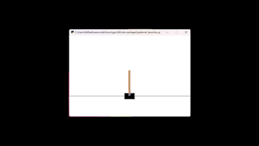
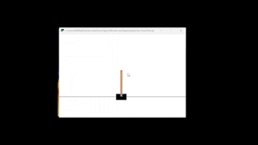

# CartPole-v1 with Q-learning made by  [Raffaele Pumpo](https://github.com/RaffaelePumpo) 

The Cartpole problem is a classic control problem in the field of reinforcement learning. It involves a pole that is attached to a cart, and the objective is to balance the pole upright on the cart by moving the cart left or right. The system is considered solved when the pole is balanced for a certain amount of time, or a certain number of time steps. 

### Tools used

For the following algorithm, I have used "anaconda3", installed gym with:

*pip install gym*

in the prompt of the anaconda 3.

**Importing required libraries**


```python
from sklearn.preprocessing import KBinsDiscretizer
import numpy as np
import gym
import time , random , math
from typing import Tuple
```

**Build the environment**


```python
env = gym.make('CartPole-v1')
```

## Q-learning

Q-Learning is a model-free, off-policy reinforcement learning algorithm. It is used to learn the optimal policy for a given Markov Decision Process (MDP) by estimating the optimal action-value function (also known as the Q-function). The Q-function represents the expected reward for taking a specific action in a specific state and following the optimal policy thereafter. The Q-learning algorithm updates the Q-function estimates iteratively based on observed state-action transitions and received rewards. The goal of Q-learning is to find the policy that maximizes the expected cumulative reward. Once the Q-function has converged, the algorithm can be used to determine the optimal policy by selecting the action with the highest Q-value for each state.

**Convert the continuous space in discrete one**


```python
n_bins = (6 ,12)
lower_bounds = [env.observation_space.low[2],-math.radians(50)]
upper_bounds = [env.observation_space.high[2],math.radians(50)]

def discretizer(_,__, angle, pole_velocity) -> Tuple[int, ...]:
    est = KBinsDiscretizer(n_bins=n_bins, encode='ordinal', strategy='uniform')
    est.fit([lower_bounds, upper_bounds])
    return tuple(map(int, est.transform([[angle, pole_velocity]])[0]))

```

**Initialise the Q value table with zeros**


```python
Q_table = np.zeros(n_bins + (env.action_space.n,))
```

**Create a policy function using Q-table and  greedly selecting the highest Q value**


```python
def policy ( state : tuple):
    return np.argmax(Q_table[state])
```

**Update the values of the table**


```python
def new_Q_value ( reward : float , state_new : tuple , discount_factor =1) ->float:
    future_optimal_value = np.max(Q_table[state_new])
    learned_value = reward + discount_factor * future_optimal_value
    return learned_value
```

**Define the rates** 


```python
def learning_rate ( n : int , min_rate = 0.1) ->float:
    return max(min_rate, min(1.0, 1.0 - math.log10((n + 1) / 25)))

def exploration_rate ( n : int , min_rate = 0.1) ->float:
    return max(min_rate, min(1, 1.0 - math.log10((n + 1) / 25)))
```

### Training 


```python
n_episodes = 2000
for episode in range (n_episodes):
    current_state , done = discretizer(*env.reset()) , False
    while not done:
        action = policy(current_state)
        if random.random() < exploration_rate(episode):
            action = env.action_space.sample()
        obs, reward, done, info = env.step(action)
        new_state = discretizer(*obs)
        lr = learning_rate(episode)
        learned_value = new_Q_value(reward, new_state)
        old_value = Q_table[current_state + (action,)]
        Q_table[current_state + (action,)] = old_value * (1 - lr) + lr * learned_value
        current_state = new_state
        if episode % 3 == 0:
            env.render()
env.close()
```

## Results

Observing the simulation, we can conclude that the algorithm just implemented It's useful for the CartPole. Initially the pole falls in a very short time, as the following video:




After different episodes, the algorithm allows to move the cart in a such a way that the pole is balanced for a certain time, as shown below:


